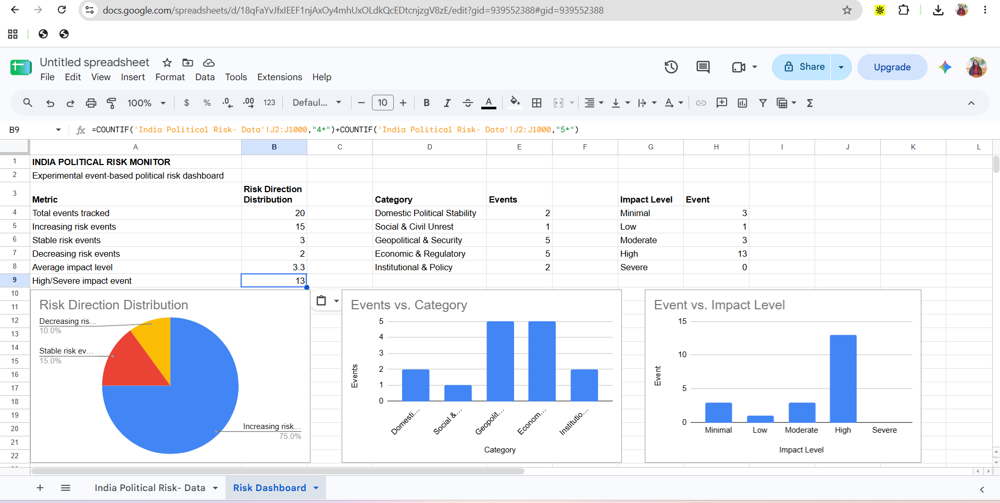

# India Political Risk Monitor

### Experimental event-based political risk dashboard for India

An ongoing open-source research project tracking political, geopolitical, security, economic, regulatory and institutional developments affecting India.

## Project Overview

The India Political Risk Monitor is an experimental event-based framework for tracking developments that may have implications for India's political, economic, security and institutional environment.

The project records individual developments and assesses them using a transparent classification framework rather than attempting to produce an official or definitive measure of political risk.

The dataset currently tracks developments across five broad categories:

- Domestic Political Stability
- Social & Civil Unrest
- Geopolitical & Security
- Economic & Regulatory
- Institutional & Policy

## Methodology

Each event is recorded using the following variables:

| Variable | Description |
|---|---|
| Date | Date of the development |
| Event | Short description of the event |
| Category | Broad risk domain |
| Sub-category | More specific issue area |
| Location | Geographic scope |
| Key actors | Main institutions or actors involved |
| What happened? | Factual description of the development |
| Why does it matter? | Potential relevance to political, economic, security or institutional conditions |
| Risk direction | Increasing, Stable or Decreasing |
| Impact level | 1–5 scale |
| Source | Source publication or institution |
| Source type | Type of source used |

### Impact Scale

Events are classified on a five-point impact scale:

1. Minimal
2. Low
3. Moderate
4. High
5. Severe

### Risk Direction

Each event is assigned one of three directional classifications:

- **Increasing**
- **Stable**
- **Decreasing**

These classifications are analytical assessments attached to individual events and should not be interpreted as objective or official measurements.

## Current Dataset

The current dataset contains 20 tracked events.

The dashboard currently shows:

- 20 total events
- 15 classified as Increasing
- 3 classified as Stable
- 2 classified as Decreasing
- Average impact level: 3.3
- 13 events classified at High or Severe impact

The largest category in the current sample is Economic & Regulatory, with 10 of the 20 tracked events.

## Limitations

This project is an experimental research framework rather than a predictive model.

Important limitations include:

- The dataset is relatively small.
- Event selection can introduce source and selection bias.
- Impact and directional classifications involve analytical judgement.
- Different analysts may classify the same event differently.
- Categories can overlap.
- The current dataset should not be interpreted as a probability of political instability or as a forecast.
- Media coverage does not necessarily represent the full universe of political or geopolitical developments.

The methodology will be refined as the dataset grows.

## Research Objective

The longer-term objective is to develop a transparent, reproducible monitoring framework that can identify patterns across political, geopolitical, economic, regulatory and institutional developments affecting India.

Future iterations may examine:

- Changes in event frequency over time
- Category-level trends
- Changes in impact distribution
- Recency-weighted observations
- Relationships between domestic and external developments
- Emerging clusters of political or geopolitical risk

## Data & Sources

The project uses publicly available reporting and institutional sources.

## Risk Dashboard

The current dashboard provides a visual summary of the event-level dataset, including risk-direction classifications, category distribution and impact-level distribution.

## Project Files

- [Dataset](india_political_risk_data.csv)
- [Methodology](METHODOLOGY.md)
- [Current Analysis](ANALYSIS.md)
- [Risk Dashboard](risk-dashboard.png)
Each event is recorded with its source publication or institution to maintain traceability.

## Status

**Ongoing — Experimental Research Project**

The dataset and methodology will be updated as new developments are tracked.
